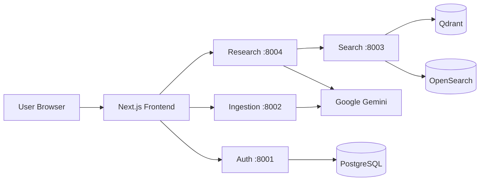

<p align="center">
  
</p>

<p align="center">
  <strong>MeraBakil 2.0</strong> — an AI-native legal operating system for Citizens, Advocates, Law Firms, and Enterprises in India.
</p>

<p align="center">
  <em>Not a chatbot wrapper.</em> A modular, microservices platform with role-based workspaces, grounded legal research (RAG), document intelligence, AI courtroom simulation, case management, and knowledge ingestion — powered by <strong>Google Gemini</strong> and a real Indian legal corpus.
</p>

<p align="center">
  
  
  
  
  
</p>

---

## Overview

MeraBakil 2.0 (AI Legal OS) delivers production-grade legal intelligence with **full citation and source attribution**. Every research answer, Mera Vakil conversation, and courtroom simulation is designed to be **grounded in retrieved legal material** — not fabricated responses.

| Capability | Description |
|------------|-------------|
| **Mera Vakil** | Conversational legal AI with citations, streaming answers, and read-aloud |
| **Research Console** | Deep grounded research with confidence scoring and live pipeline |
| **AI Courtroom** | Simulated hearings with Judge & Advocate AI agents (Gemini-powered) |
| **Documents** | Upload, manage, and query your legal documents |
| **Case Management** | Track matters, status, and timelines |
| **Knowledge Hub** | Ingest PDFs/JSON into vector + keyword indexes (admin) |
| **Lawyer Marketplace** | Browse and book consultations (UI layer; sample profiles) |
| **Role-Based Access** | Citizen, Advocate, Law Firm, Enterprise, Admin workspaces |

<p align="center">
  
  &nbsp;
  
  &nbsp;
  
</p>

---

## Architecture

```text
frontend/         Next.js 15 + TypeScript + Tailwind + ShadCN + React Query
backend/
  libs/           Shared Python library (legalos_common)
  services/       FastAPI microservices (auth, ingestion, search, research, …)
  orchestrator/   LangGraph multi-agent reasoning pipeline
data-platform/    Bulk ingestion workers and embedding pipeline
raw-data/         Real Indian legal corpus (Constitution, articles, NLPRAG, PDFs)
infrastructure/   Docker Compose, Kubernetes, Helm, monitoring
docs/             Architecture, security, production runbooks
```



**Design principles:** Clean Architecture / DDD per service · Event-driven Kafka integration · Hybrid retrieval (vector + keyword + RRF) · JWT + RBAC on every protected route.

---

## Role-Based Modules

| Role | Workspaces |
|------|------------|
| **Admin** | All modules + User Management + Knowledge Hub |
| **Law Firm** | Mera Vakil, Courtroom, Research, Cases, Documents, Knowledge Hub |
| **Advocate** | Mera Vakil, Courtroom, Research, Cases, Documents |
| **Enterprise** | Mera Vakil, Courtroom, Research, Documents |
| **Citizen** | Mera Vakil, Research, Marketplace, Cases |

Register at `/register` and choose your role. Permissions are enforced server-side via JWT claims.

---

## Prerequisites

| Requirement | Version / Notes |
|-------------|-----------------|
| **Docker & Docker Compose** | Required for full stack (`make up`) |
| **Python** | 3.12+ with `uv` or `venv` |
| **Node.js** | 20+ (for native frontend dev) |
| **Google AI API key** | [Google AI Studio](https://aistudio.google.com/apikey) — for LLM, embeddings, and TTS |
| **RAM** | 8 GB minimum (16 GB recommended for Docker stack) |
| **Disk** | ~4 GB for containers + corpus |

> **Real functionality:** Set `LLM_USE_STUB=false` and `EMBEDDING_USE_STUB=false` in `.env` and provide valid Gemini API keys. Stub mode is for offline development only.

---

## Quick Start (Recommended — Docker)

### 1. Clone and configure

```bash
git clone https://github.com/Intellicrafts/Merabakil_2.0.git
cd Merabakil_2.0

cp .env.example .env
```

Edit `.env` and set your **real** API keys:

```env
LLM_API_KEY=your-google-ai-api-key
EMBEDDING_API_KEY=your-google-ai-api-key
LLM_USE_STUB=false
EMBEDDING_USE_STUB=false
LLM_MODEL=gemini-3.1-pro-preview
EMBEDDING_MODEL=gemini-embedding-001
```

### 2. One-time Docker setup

```bash
bash scripts/setup_docker.sh   # fixes docker.sock permissions (may ask for sudo)
newgrp docker                  # or log out and back in
docker ps                      # verify Docker works
```

### 3. Bootstrap everything (stack + seed + real corpus ingest)

```bash
bash scripts/run_production_stack.sh
```

This will:
1. Build and start all services (Postgres, Redis, Qdrant, OpenSearch, Neo4j, Kafka, MinIO, microservices, frontend)
2. Seed roles, permissions, and admin user
3. **Bulk-ingest `raw-data/`** (~1,250+ legal chunks) into Qdrant + OpenSearch
4. Run RAG evaluation and health checks

**First run takes 5–15 minutes** (embedding the full corpus with Gemini).

### 4. Open the application

| Service | URL |
|---------|-----|
| **Frontend** | http://localhost:3000 |
| **Mera Vakil** | http://localhost:3000/mera-vakil |
| **AI Courtroom** | http://localhost:3000/courtroom |
| **Dashboard** | http://localhost:3000/dashboard |
| Auth API docs | http://localhost:8001/docs |
| Research API docs | http://localhost:8004/docs |

**Default admin (change in production):**

| Field | Value |
|-------|-------|
| Email | `admin@legalos.in` |
| Password | `ChangeMe!2026` |

Or create a new account at http://localhost:3000/register.

---

## Alternative: Native Dev Stack (no Docker)

For faster frontend iteration with live reload:

```bash
cp .env.example .env
# Set LLM_API_KEY, EMBEDDING_API_KEY, LLM_USE_STUB=false, EMBEDDING_USE_STUB=false

python3 -m venv .venv
source .venv/bin/activate
pip install -e backend/libs/legalos_common
# Install service deps as needed, or use: cd backend && uv sync

make native
```

Native stack starts Auth (:8001), Search (:8003), Research (:8004), and Next.js dev server (:3000). Search embeds `raw-data/` on first boot (~3–5 min).

---

## Real Data — No Stubs

This repository ships with a **real legal corpus** under `raw-data/`:

| Source | Content |
|--------|---------|
| `Indian_constitution/` | Constitution JSON |
| `All_articels_of_indian_constitution/` | Article dictionary |
| `Indian_law_and_supreme_cort/` | NLPRAG CSV legal database |
| `All amendments/` | Amendment PDFs |
| `Repealed Laws/` | Repealed legislation PDFs |

After adding new files:

```bash
make bulk-ingest          # incremental ingest
make bulk-ingest -- --force   # full re-index
```

**What uses real AI vs UI samples:**

| Feature | Data source |
|---------|-------------|
| Research, Mera Vakil, Search | Real corpus + Gemini (when stubs off) |
| AI Courtroom | Gemini LLM adapter (live) or offline fallback |
| Knowledge Hub ingest | Real PDF/JSON parsing + embedding |
| Lawyer Marketplace profiles | Sample UI data (backend service pending) |

---

## Makefile Commands

```bash
make help           # Show all commands
make up             # Start Docker stack
make down           # Stop stack
make seed           # Seed roles + admin user
make bulk-ingest    # Index raw-data/ corpus
make eval-rag       # Run RAG quality benchmark
make health         # Health-check all services
make native         # Native dev stack (no Docker)
make test           # Run backend test suites
make logs           # Tail container logs
```

---

## Environment Variables (Key)

| Variable | Purpose |
|----------|---------|
| `LLM_API_KEY` | Google Gemini API key for reasoning |
| `EMBEDDING_API_KEY` | Gemini embeddings for vector search |
| `LLM_USE_STUB` | `false` = real AI (required for production) |
| `EMBEDDING_USE_STUB` | `false` = real embeddings |
| `LLM_MODEL` | e.g. `gemini-3.1-pro-preview` |
| `EMBEDDING_MODEL` | `gemini-embedding-001` |
| `SEED_ADMIN_EMAIL` | Override default admin email |
| `SEED_ADMIN_PASSWORD` | Override default admin password |

See [`.env.example`](.env.example) for the full list.

---

## Troubleshooting

<details>
<summary><strong>Login / Register fails</strong></summary>

- Ensure Auth is running: http://localhost:8001/health
- **409 on register** = email already exists → use Sign in instead
- **Cannot reach auth service** → run `make up` or `make native`
</details>

<details>
<summary><strong>Research returns generic / stub answers</strong></summary>

- Confirm `.env` has `LLM_USE_STUB=false` and valid `LLM_API_KEY`
- Restart services after changing `.env`: `make down && make up`
</details>

<details>
<summary><strong>Search returns no results</strong></summary>

- Run corpus ingest: `make bulk-ingest`
- Wait for embedding to finish (check logs: `make logs`)
</details>

<details>
<summary><strong>Port 3000 already in use</strong></summary>

- Stop conflicting process or Docker frontend: `docker stop ai-legal-os-frontend-1`
- Native dev may fall back to :3001 — check terminal output
</details>

<details>
<summary><strong>Docker permission denied</strong></summary>

```bash
bash scripts/setup_docker.sh
newgrp docker
```
</details>

---

## Security Checklist (Production)

- [ ] Change `SEED_ADMIN_PASSWORD` before `make seed`
- [ ] Generate strong `JWT_SECRET_KEY` and `FIELD_ENCRYPTION_KEY`
- [ ] Never commit `.env` — only `.env.example`
- [ ] Rotate API keys regularly
- [ ] Run `make health` after every deploy

See [docs/SECURITY.md](docs/SECURITY.md) and [docs/PRODUCTION_SETUP.md](docs/PRODUCTION_SETUP.md).

---

## Project Structure

```text
Merabakil_2.0/
├── frontend/              Next.js application (all UI modules)
├── backend/
│   ├── libs/legalos_common/   Shared clients, RBAC, LLM, config
│   ├── services/              Auth, Ingestion, Search, Research, …
│   └── orchestrator/          LangGraph agent pipeline
├── data-platform/workers/     Bulk ingest scripts
├── raw-data/                  Real Indian legal corpus
├── infrastructure/            Docker Compose, K8s, Helm
├── docs/                      Architecture, security, assets
└── scripts/                   Setup, health, production bootstrap
```

---

## Contributing

1. Fork the repository
2. Create a feature branch: `git checkout -b feature/your-feature`
3. Run tests: `make test`
4. Commit and open a Pull Request

---

## License

Proprietary — © Intellicrafts. All rights reserved unless otherwise specified.

---

<p align="center">
  <strong>MeraBakil 2.0</strong> · Built for India's legal ecosystem · Grounded · Cited · Role-aware
</p>
