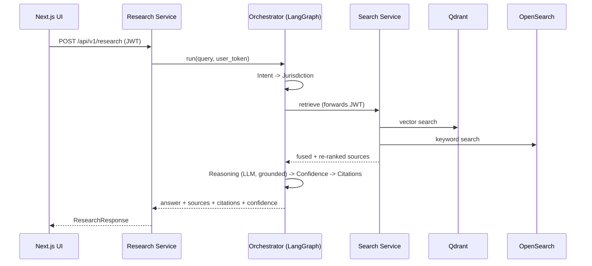

# Architecture

## Principles

- **Clean Architecture / DDD** in every service: `domain` (entities, value objects, pure
  logic) -> `application` (use cases, ports, CQRS-style commands/queries) ->
  `infrastructure` (repositories, clients, messaging) -> `api` (FastAPI routers).
- **Dependency rule**: inner layers never import outer layers. The `application`
  layer depends on *ports* (Protocols); `infrastructure` provides adapters.
- **Repository + Service Layer** patterns isolate persistence from business rules.
- **Event-Driven**: services integrate asynchronously via Kafka topics with typed
  envelopes (`legalos_common.messaging.events`).
- **Microservices**: each service is independently deployable and independently
  testable, sharing only the `legalos_common` library and event contracts.

## Phase 1 components

| Component | Port | Responsibility |
|-----------|------|----------------|
| Auth Service | 8001 | Register/login/refresh/password-reset, RBAC, user management |
| Knowledge Ingestion | 8002 | Parse, OCR, clean, chunk, embed, index (Qdrant), graph (Neo4j), store (S3) |
| Search Service | 8003 | Vector + keyword + hybrid (RRF) retrieval with re-ranking |
| Research Service | 8004 | Orchestrated, grounded answers with citations + confidence |
| Orchestrator (lib) | - | LangGraph multi-agent flow used by Research |
| Frontend | 3000 | Login + research console |

## Request flow (research)

## Data stores

- **PostgreSQL** - relational source of truth (users, cases, documents, judgments, ...).
- **Qdrant** - dense vector index for semantic retrieval.
- **OpenSearch** - BM25 keyword index.
- **Neo4j** - citation/knowledge graph (documents -> cited references).
- **Redis** - rate limiting and caching.
- **Kafka** - asynchronous ingestion + audit events.
- **S3 / MinIO** - original document blobs.

## Provider abstraction

LLM and embeddings are accessed through `legalos_common.clients.llm`. The default is
an OpenAI-compatible HTTP client; setting `LLM_USE_STUB=true` switches to a
deterministic offline implementation so the whole platform runs without external
API keys (used by docker-compose and the test suite).

## Roadmap

- **Phase 2** services: Case, Document, Reasoning, Litigation, Drafting, Contract
  Review, Compliance, Lawyer Marketplace, Billing, Audit; plus the remaining agents.
- **Phase 3**: Kubernetes/Helm hardening, full observability, autoscaling, E2E +
  load testing, and real legal-corpus ingestion connectors. See [ROADMAP.md](ROADMAP.md).
